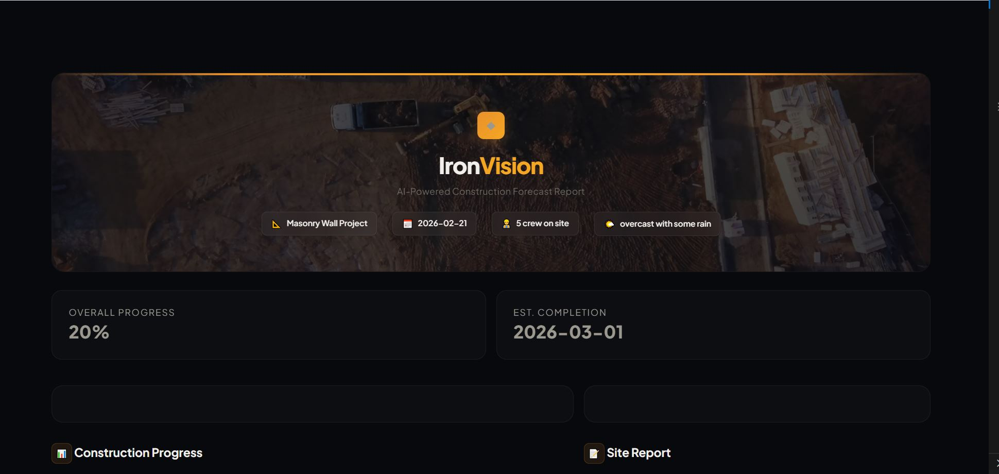
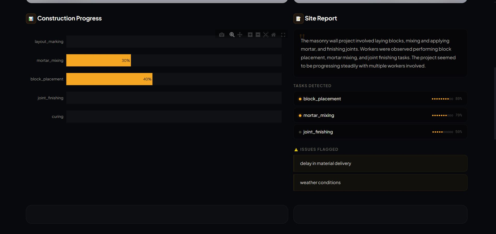
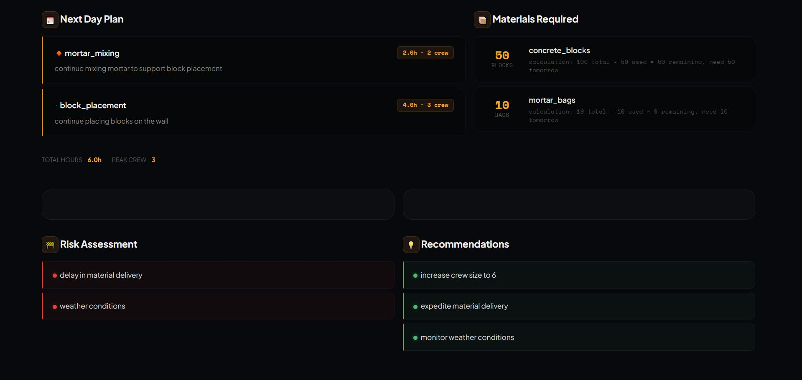

# 🔶 IronVision Forecaster

**Turn today's site footage into tomorrow's game plan.**

IronVision Forecaster watches construction site video, understands what got done, and tells you exactly what to do next — tasks, materials, crew, risks, all in one dashboard.

---

## The Problem

Construction site managers lose **nearly 20% of every workday** to material transport delays caused by reactive planning. That's not a technology problem — it's a visibility problem.

Ironsite's smart hardhat cameras already capture hours of first-person footage every day. But right now, that footage mostly sits in storage. Every evening, a site manager has to manually review the day, figure out what got done, decide what comes next, and calculate what materials to stage for the morning.

That process takes **30–60 minutes per site, per day** — and it's still guesswork.

We asked a simple question: *what if the footage could plan tomorrow for you?*

---

## What We Built

IronVision Forecaster is a two-stage AI pipeline that connects **what happened on site today** to **what should happen tomorrow**.

**Stage 1 — See:** A vision model watches the day's footage and produces a structured report — what tasks were performed, what materials were used, how many crew were on site, and what issues came up.

**Stage 2 — Plan:** A reasoning model takes that report, compares it against the project blueprint, and generates a next-day plan — which tasks to prioritize, exactly how many blocks and bags of mortar to stage, who to assign where, and what risks to watch for.

The result is a single dashboard that a site manager can open every morning and know exactly what the day looks like.

---

## Dashboard

### Project overview at a glance


### AI-generated progress analysis and site report


### Tomorrow's plan, materials, risks, and recommendations


---

## How It Works

```
    🎥 Site Video (hardhat camera)
         │
         ▼
  ┌──────────────────┐
  │  Frame Extraction │  OpenCV pulls 20 key frames,
  │  & Grid Stitching │  packs them into 5 grid images
  └────────┬─────────┘
           │
           ▼
  ┌──────────────────┐
  │   Vision Model   │  Llama 4 Scout 17B (via Groq)
  │                  │  "What work happened today?"
  │                  │
  │  Outputs:        │  → Tasks observed + status
  │                  │  → Materials used + quantities
  │  video_summary   │  → Crew size, weather, issues
  │  .json           │  → Confidence scores
  └────────┬─────────┘
           │
           │      ┌─────────────────┐
           │      │  Blueprint.json │
           │      │  (project plan) │
           │      └────────┬────────┘
           │               │
           ▼               ▼
  ┌──────────────────────────┐
  │     Reasoning Model      │  Llama 3.3 70B (via Groq)
  │                          │  "What should happen tomorrow?"
  │                          │
  │  Compares progress vs    │  → Next-day task plan
  │  blueprint, checks       │  → Material quantities needed
  │  dependencies, estimates │  → Risk assessment
  │  remaining work          │  → Crew recommendations
  │                          │
  │  prediction.json         │
  └────────┬─────────────────┘
           │
           ▼
  ┌──────────────────┐
  │    Dashboard     │  Streamlit + Plotly
  │   (IronVision)   │  Morning-ready forecast report
  └──────────────────┘
```

---

## Tech Stack

| Layer | What | Why |
|-------|------|-----|
| **Vision Model** | Llama 4 Scout 17B via Groq | Fast, free, handles multi-image input well for construction scene understanding |
| **Reasoning Model** | Llama 3.3 70B via Groq | Strong at structured reasoning — maps observations to blueprint logic accurately |
| **Frame Processing** | OpenCV + NumPy | Extracts 20 frames, stitches into 2×2 grids to fit within API image limits |
| **Dashboard** | Streamlit + Plotly | Custom dark industrial theme with glass morphism UI and live video background |
| **Backend** | Python | Lightweight, fast to build, everything runs from a single pipeline command |

---

## Project Structure

```
ironsite-hackathon/
│
├── blueprint.json                 # The project plan — steps, materials, dependencies
├── .streamlit/config.toml         # Streamlit config (enables static file serving)
├── static/bg.mp4                  # Aerial construction video for dashboard background
│
├── pipeline/
│   ├── prompts.py                 # VLM prompt templates
│   ├── video_summarizer.py        # Stage 1: Video → structured summary
│   ├── planner_prompts.py         # LLM prompt templates
│   ├── planner.py                 # Stage 2: Summary + blueprint → forecast
│   ├── run_pipeline.py            # One-command full pipeline
│   └── safe_run.py                # Demo-safe version with fallback caching
│
├── dashboard/
│   └── dashboard.py               # The IronVision Forecast Report
│
├── data/
│   ├── sample_videos/masonry.mp4  # Sample construction footage
│   ├── output/                    # Pipeline-generated JSONs
│   └── mock/                      # Cached outputs for demo fallback
│
└── screenshots/                   # Dashboard screenshots for README
```

---

## Getting Started

### Clone the repository
```bash
git clone https://github.com/meghnag2712/Ironsite-hackathon.git
cd Ironsite-hackathon
```

### Install dependencies

```bash
pip install groq opencv-python numpy streamlit plotly
```

### Set your API key

Get a free key at [console.groq.com/keys](https://console.groq.com/keys)

```bash
# Mac / Linux
export GROQ_API_KEY="your-key-here"

# Windows PowerShell
$env:GROQ_API_KEY="your-key-here"
```

### Run the full pipeline

```bash
python pipeline/run_pipeline.py data/sample_videos/masonry.mp4 --blueprint blueprint.json
```

This runs both stages — video analysis and forecast planning — and saves the outputs to `data/output/`.

### Launch the dashboard

```bash
python -m streamlit run dashboard/dashboard.py
```

Opens at `http://localhost:8501`.

### Demo mode (safe for live presentations)

If the API goes down during a demo, this version falls back to cached outputs:

```bash
python pipeline/safe_run.py data/sample_videos/masonry.mp4 blueprint.json
python -m streamlit run dashboard/dashboard.py
```

---

## Business Impact

**What this gives a site manager:**

Every morning, instead of flipping through notes and footage, they open one dashboard and see — here's what got done yesterday, here's what the team should tackle today, here's exactly how many blocks and bags of mortar to have on the floor, and here's what might go wrong.

That's not a nice-to-have. That's how you stop losing 20% of every workday to reactive planning.

**Specifically, IronVision:**

- Eliminates 30–60 minutes of manual evening planning per site, per day
- Prevents material shortages — the #1 cause of on-site idle time
- Catches issues early — weather, delivery delays, crew gaps
- Creates a data trail — daily AI-generated progress logs for every project
- Scales across sites — same pipeline, different blueprints

---

## What's Next

We built this in 36 hours. Here's where it goes from here:

- **Next-hour prediction** — intra-day micro-forecasting from live camera feeds, not just end-of-day summaries
- **Automatic inventory triggers** — when predicted material needs exceed on-site stock, auto-generate purchase orders
- **Multi-site dashboard** — one view across all active projects for operations leaders
- **Weather-aware scheduling** — pull forecast data and auto-adjust the next-day plan for rain, heat, or wind
- **Historical learning** — train on past project data to improve accuracy over time
- **Crew optimization** — recommend how to split workers across concurrent tasks for maximum throughput

---

*IronVision Forecaster — because the best time to plan tomorrow is while today's footage is still fresh.*
